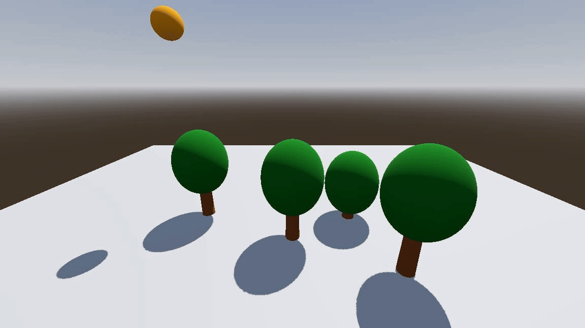

# Lesson 1 Prototype - GoDot Game Development

## Project Overview

This project is a prototype for Lesson 1 of a GoDot Game Development course. It introduces basic concepts of game development using the GoDot engine.

## Stages

### Stage 1: Introduction to Godot/Game Development

- Overview of the GoDot engine and its capabilities.

### Stage 2: Installation

- Instructions for installing the GoDot editor from the offical site or the mirrored v4.3.

### Stage 3: Material Distribution

- Distribution of necessary materials for the course.

### Stage 4 - 5: Godot Basics

- Running the game window.
- Selecting and running the "MainScene" node.

### Stage 6 - 7: Introduce Node System

- Creating a box as ground and adding objects on the ground as a 3D scene.
- Introduction to basic 3D objects like box, sphere, and cylinder.

### Stage 8 - 9: Basic 3D Objects/Meshes

- Creating and manipulating basic 3D objects and meshes.

### Stage 10: Characteristics of different 3D Bodies

- Introduction to different 3D bodies like `StaticBody` and `RigidBody`.

### Stage 11: Duplicating nodes

- Duplicating nodes and creating a simple 3D scene.

## Additional Resources

- [Lesson Flow](lesson_flow.yaml)
- [Demo Video](lesson-1-prototype-demo.avi)
